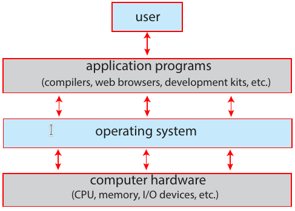
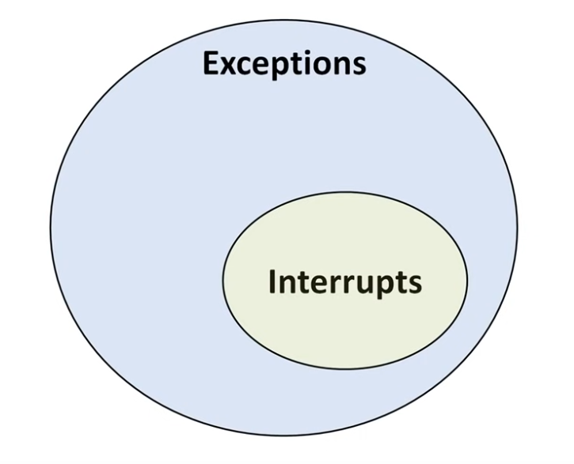

=======================
Operating System Basics
=======================

Introduction
=============

Computer System Structure
----------------------------

Computer System:

* hardware

  * provides the basic computing resources for the system

* operating system

  * controls the hardware and coordinates its use among the various application
    programs for the various users

* application programs

  * define the ways in which these resources are used to solve users’ computing
    problems

* user

  * people, machines, and other computers

Hardware:

* CPU
* memory
* I/O devices

   Abstract view of the components of a computer system.

Operating System
-------------------

From the user's perspective, operating System is virtual machine that serves as
an interface between user and architecture. Operating system hides
architectural details and **easier to program** than raw hardware.

From the computer’s point of view, the operating system is the program most
intimately involved with the hardware. In this context, we can view an oper-
ating system as a **resource allocator**. A computer system has many resources
that may be required to solve a problem: CPU time, memory space, storage
space, I/O devices, and so on. The operating system acts as the manager of these
resources. Facing numerous and possibly conflicting requests for resources, the
operating system must decide how to allocate them to specific programs and
users so that it can operate the computer system efficiently and fairly.

A slightly different view of an operating system emphasizes the need to
control the various I/O devices and user programs. An operating system is a
control program. A **control program** manages the execution of user programs
to prevent errors and improper use of the computer. It is especially concerned
with the operation and control of I/O devices.

The fundamental goal of computer systems is
to execute programs and to make solving user problems easier. Computer
hardware is constructed toward this goal. Since bare hardware alone is not
particularly easy to use, application programs are developed. These programs
require certain common operations, such as those controlling the I/O devices.
The common functions of controlling and allocating resources are then brought
together into one piece of software: the operating system.

There is no commonly accepted definition of operating system.
For sure, the operating sytem includes the program that runs all the time
while computer system is running, which is the **kernel**. 

Recently, operating system vendors are adding more and more components to 
their operating systems. For example, Android and IOS are adding the
*middleware* -- the software framework that helps developers to applications. 

Finally, we might say that operating system includes the always-running kernel,
middleware frameworks that ease application development
and provide features, and system programs that aid in managing the system
while it is running.

Computer-System operation
==========================

Interrupts
------------

The **interrupt** is the signal from the external source, the hardware, like I/O, 
or external device, that will interrupt the normal control flow of the CPU.

Simply, interrupt is something that changes normal execution flow of the 
program. Interrupts are *exceptions*, however the 
interrupts are only those that invoced not from the CPU, but from the external 
source, like I/O. Generally, interrupts are accepted as the subset of exceptions.

The interrupt handling
~~~~~~~~~~~~~~~~~~~~~~~

#. Saving current context

   * When an interrupt occurs, CPU cannot simply abandon its current program and
     start handling the interrupt. It has to store the program counter and registers,
     in order to being able to proceed the execution of the currunt program after
     the interrupt is handled. 

#. Identify interrupt service routine (or handler)
   
   * In order to detect how to handle the interrupt CPU refers to the *interrupt vector*,
     which is the table, that stores the interrupt service routines.
     The *interrupt serves routines* are the instructions on how to respond to the given interrupt.

#. Jumps to interrupt service routine and handles the interrupt. 

#. Restores the current context, and proceeds the execution of the interrupted program.

